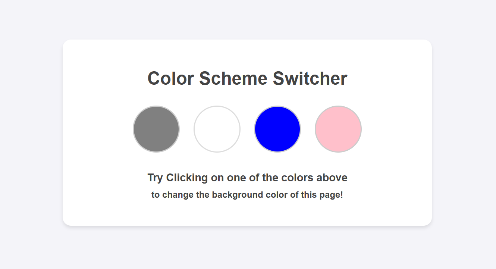
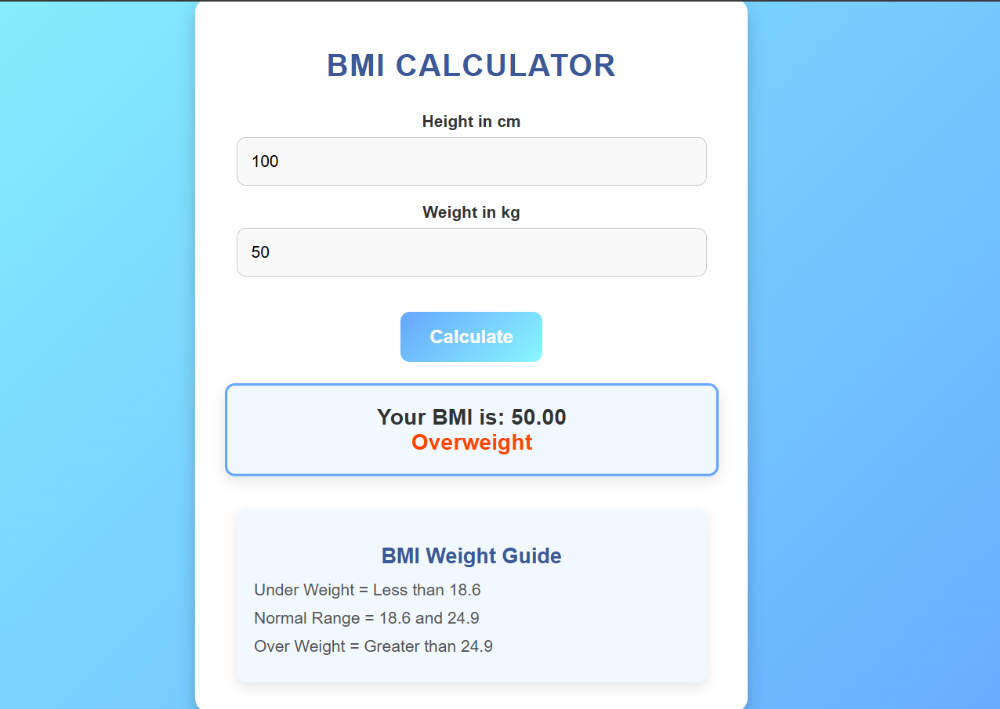
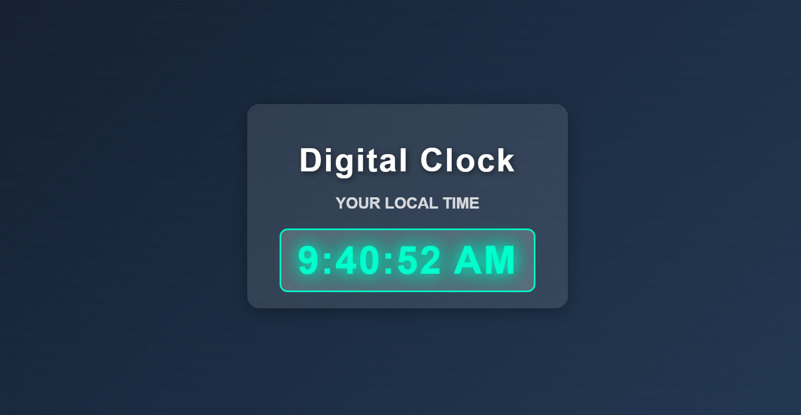
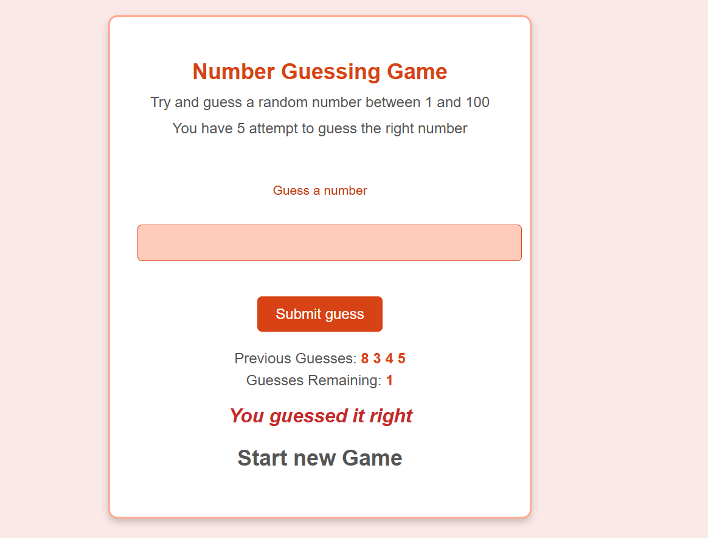
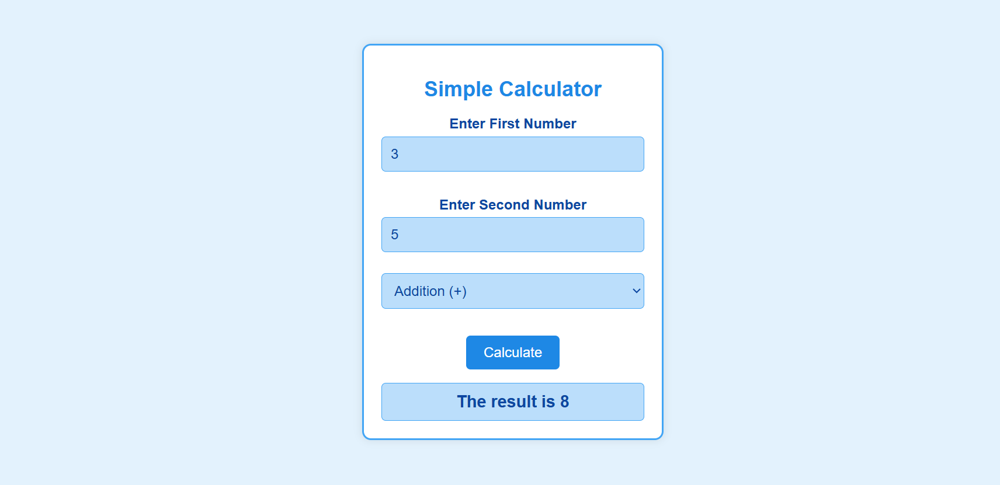

# Projects related to DOM

## Project 01
### Color Scheme Switcher

This is a beginner-friendly DOM manipulation project designed to help you understand the basics of working with HTML, CSS, and JavaScript. The project creates an interactive webpage where users can dynamically change the background color of the page by clicking on different color buttons.  

## Project 02
### BMI Convertor

A BMI Converter is a tool that calculates an individual's Body Mass Index(BMI) using their height and weight to assess their health status. It categorizes the result into underweight, normal, or overweight ranges. By providing instant feedback and a simple interface, it helps users evaluate whether they fall within a healthy weight range, offering a quick and practical way to monitor their fitness. 

## Project 03

### Digital Clock

A Digital Clock is a modern timekeeping tool that displays the current time in a clear and precise format, typically showing hours, minutes, and seconds. Unlike analog clocks, it provides a straightforward numerical display, often enhanced with dynamic features like glowing effects or real-time updates, making it visually appealing and easy to read. 

## Project 04

### Number Guessing Game

This mini-project, "Guess the Number," is an interactive web-based game where players attempt to guess a randomly generated number between 1 and 100 within five attempts. Built using HTML, CSS, and JavaScript, the game provides real-time feedback on each guess, indicating whether the guessed number is too high or too low. 

## Project 05

### Simple Calculator

A simple calculator is a fundamental tool that performs basic arithmetic operations such as addition, subtraction, multiplication, and division. It allows users to input two numbers, select an operation, and instantly receive a calculated result. This project, built using HTML, CSS, and JavaScript, provides an interactive and user-friendly interface for quick calculations. The JavaScript logic ensures error handling for invalid inputs and prevents division by zero, making the calculator both efficient and reliable. 

